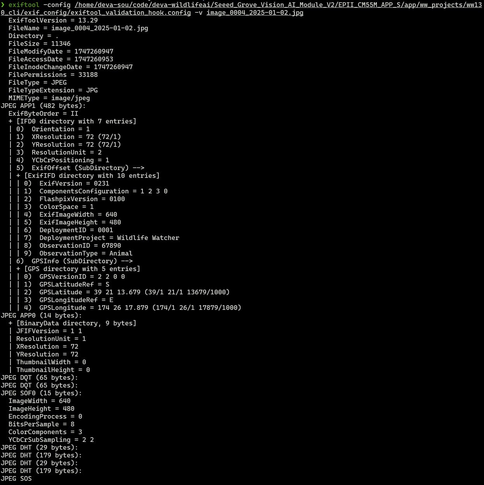
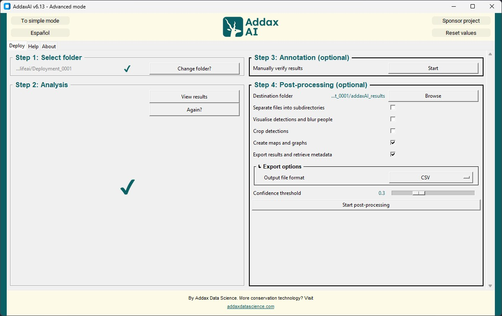
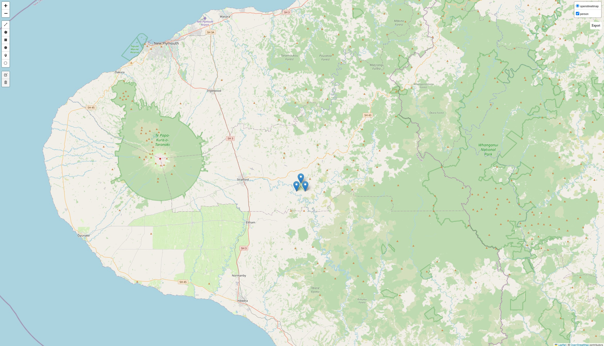
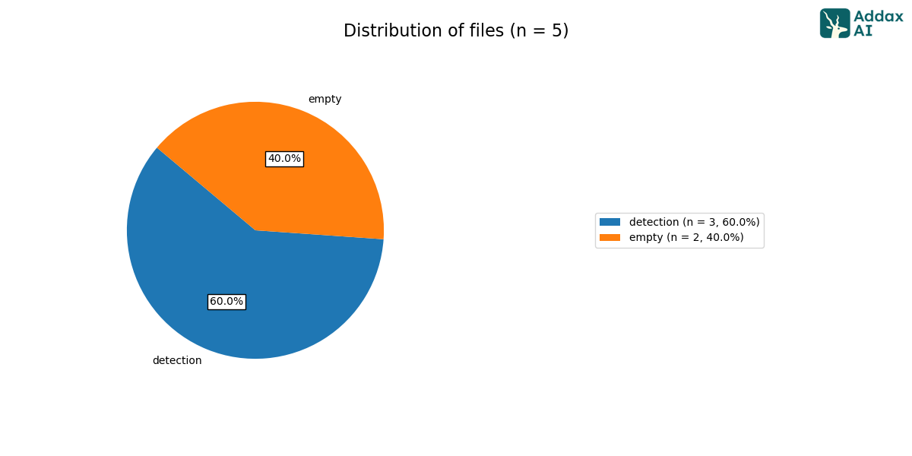
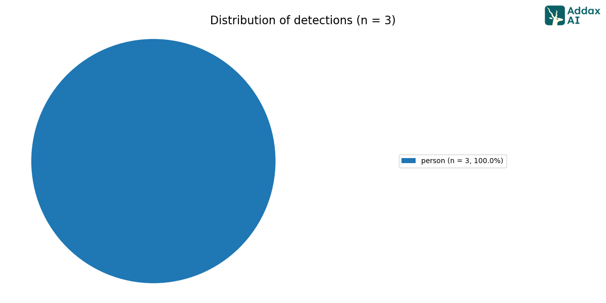

From [wildlife.ai](https://wildlife.ai/)  
For [Wildlife Watcher](https://wildlife.ai/projects/wildlife-watcher/) project  

# AddaxAI for MVP1

[](../pdf/image_processing_addaxAI.pdf)

Report regarding using AddaxAI for MVP#1 as an annotation tool with images from WW500.  
Why AddaxAI? [Here](https://github.com/wildlifeai/wildlife-watcher-testing/blob/main/_documentation/data_science_testing/addaxAI_testing/report_addaxAI_testing_camtrap.md) is how and why AddaxAI could be useful in our worflow.

1. [Images from WW500](#images-from-ww500)
2. [Output from AddaxAI](#output-from-addaxai)

## Images from WW500

For this test, I used the WW500 and the firmware from GitHub [code base](https://github.com/wildlifeai/Seeed_Grove_Vision_AI_Module_V2) branch `exif-app1`.  
I recorded 5 images. Extract them from the SD cards and checked the EXIF information.  

### WW500 deployment folder structure

They have the following structure:  
.  
└── images  
    ├── image_0001_2025-01-02.jpg  
    ├── image_0002_2025-01-02.jpg  
    ├── image_0003_2025-01-02.jpg  
    ├── image_0004_2025-01-02.jpg  
    └── image_0005_2025-01-02.jpg  

#### Example of image and exif information in it




## Output from AddaxAI

### Steps to get the output from AddaxAI

1. Open AddaxAI
2. Extract the target deployment folder from the SD card
3. Drag and drop the whole folder

### Steps in AddaxAI

1. Select the folder containing your project on a CampTrap DP format
2. Run the analysis
3. (optionnal): Manually check the annotations
4. (optionnal): Get the post-processing done, which will create two things: `results.csv` and `graphs` folder

#### 1. Drag and drop folder | 2. Run the analysis

Here I selected MegaDetector cause it was image of a human (aka me).


#### 3. Annotation | 4. Post processing

Here I selected the destination folder as `Deployment_0001/addaxAI_results`, a folder that I created before. The output file format that I chose was `csv` (it's either excel or csv)


### Results

#### Result folder structure

.  
├── graphs  
│   ├── maps  
│   │   ├── class-specific  
│   │   │   └── person.html  
│   │   ├── combined-multi-layer.html  
│   │   └── combined-single-layer.html  
│   └── pie-charts  
│       ├── distribution-detections.html  
│       ├── distribution-detections.png  
│       ├── distribution-files.html  
│       └── distribution-files.png  
├── results_detections.csv  
├── results_files.csv  
└── results_summary.csv  

In [`results_summary.csv`](#content-of-results_summarycsv) you'll find a summary of the detections as a CSV file.  

In [`CamTrap_dataset/image_recognition_file.json`](#sample-of-camtrap_datasetimage_recognition_filejson) you'll have a summary of the detections as a JSON file.  

In [`results_detections.csv`](#example-of-results_detectionscsv) you'll find for each image of interest, the result and the exif information read from `media.csv`.  

In `graph` you'll find some charts about the analysis.  

#### Content of `results_summary.csv`

| label  | data_type | n_detections |
| ------ | --------- | ------------ |
| person | img       | 3            |

#### Sample of `CamTrap_dataset/image_recognition_file.json`

```json
{
 "images": [
  {
   "file": "image_0001_2025-01-02.jpg",
   "detections": [
    {
     "category": "2",
     "conf": 0.557,
     "bbox": [
      0,
      0,
      0.9984,
      1.0
     ]
    }
   ]
  },
```

#### Example of `results_detections.csv`

| absolute_path                                           | relative_path             | data_type | label  | confidence | human_verified | bbox_left | bbox_top | bbox_right | bbox_bottom | file_height | file_width | DateTimeOriginal | DateTime | DateTimeDigitized | Latitude           | Longitude          | GPSLink                                                          | Altitude | Make | Model | Flash | ExifOffset | ResolutionUnit | YCbCrPositioning | XResolution | YResolution | ExifVersion | ComponentsConfiguration | FlashPixVersion | ColorSpace | ExifImageWidth | ISOSpeedRatings | ExifImageHeight | ExposureMode | WhiteBalance | SceneCaptureType | ExposureTime | Software | Sharpness | Saturation | ReferenceBlackWhite |
| ------------------------------------------------------- | ------------------------- | --------- | ------ | ---------- | -------------- | --------- | -------- | ---------- | ----------- | ----------- | ---------- | ---------------- | -------- | ----------------- | ------------------ | ------------------ | ---------------------------------------------------------------- | -------- | ---- | ----- | ----- | ---------- | -------------- | ---------------- | ----------- | ----------- | ----------- | ----------------------- | --------------- | ---------- | -------------- | --------------- | --------------- | ------------ | ------------ | ---------------- | ------------ | -------- | --------- | ---------- | ------------------- |
| C:/Users/Deva/Desktop/Wildlifeai/Deployment_0001/images | image_0001_2025-01-02.jpg | img       | person | 0.557      | False          | 0         | 0        | 639        | 480         | 480         | 640        | NA               | NA       | NA                | -39.35379972222222 | 174.43829972222224 | https://maps.google.com/?q=-39.35379972222222,174.43829972222224 | NA       | NA   | NA    | NA    | 314        | 2              | 1                | 72.0        | 72.0        | b'0231'     | b'\\x01\\x02\\x03\\x00' | b'0100'         | 1          | 640            | NA              | 480             | NA           | NA           | NA               | NA           | NA       | NA        | NA         | NA                  |

#### Example of `graphs/maps/`

AddaxAI is making charts based on the EXIF info. On the CamTrap example, it did charts regarding temporal distribution, here we have spacial distribution and label distribution. On the map you can filter labels. 



#### Example of `graphs/pie-charts/`




