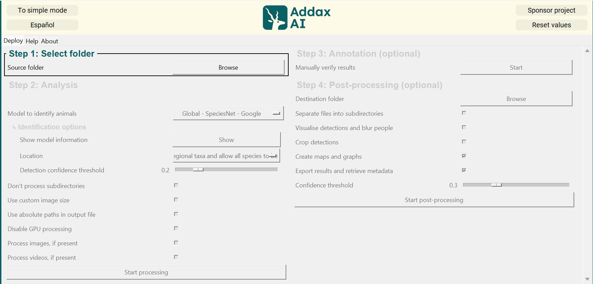
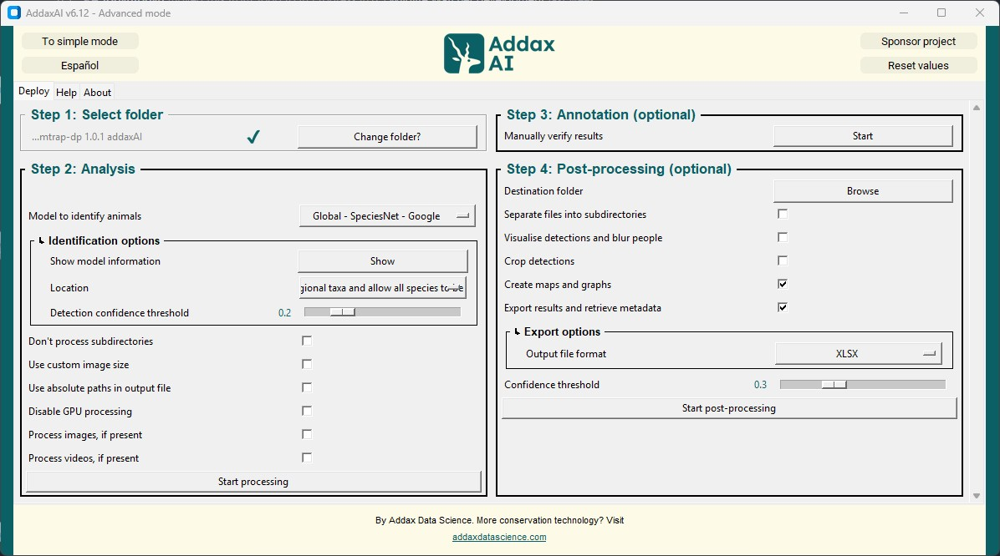
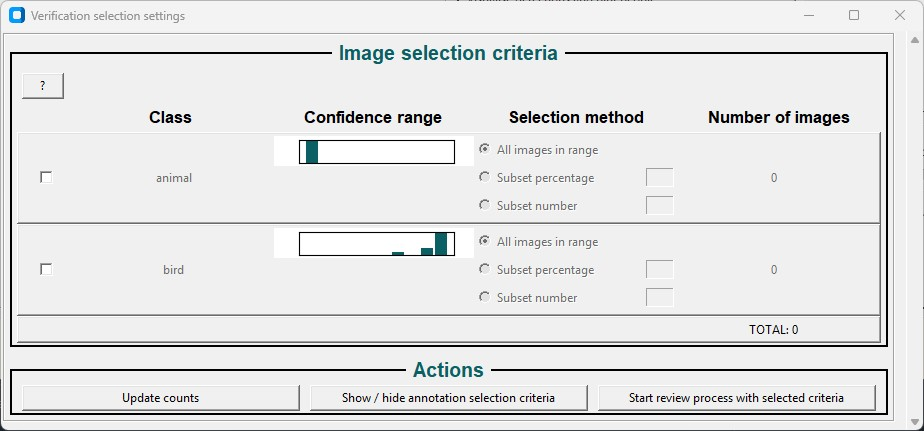
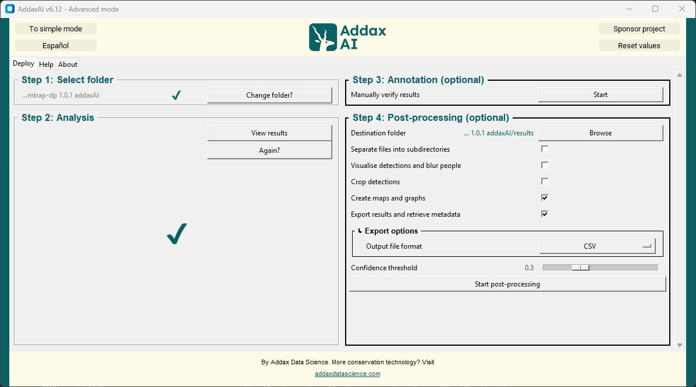
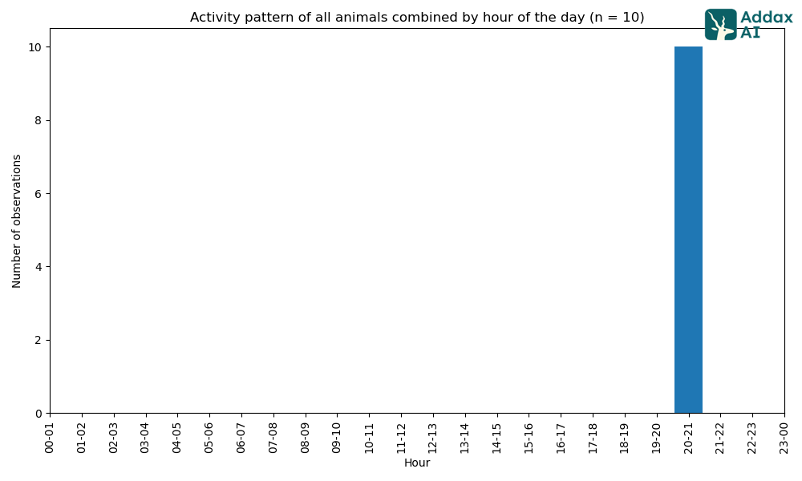
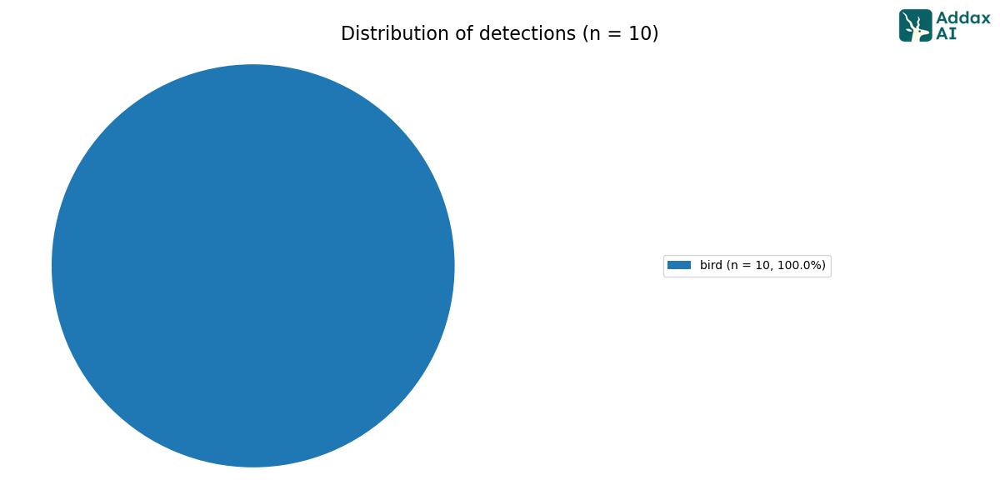

From [wildlife.ai](https://wildlife.ai/)  
For [Wildlife Watcher](https://wildlife.ai/projects/wildlife-watcher/) project  

# AddaxAI for wildlife.ai with CamTrap DP datasets

[](../pdf/image_processing_addaxAI_camtrap.pdf)

Report regarding using AddaxAI for MVP#1 as an annotation tool with images from CampTrap dataset example.  
Why AddaxAI? [Here](https://docs.google.com/document/d/1O7rSCjLETNXNGhgrAzjeOxbeF5Swm5d1FKxGTB1orLk/edit?usp=sharing) is a small tool comparision for image annotation containing EXIF information.  
It's the easiest tool to just drag and drop folder and get annotations + reading the EXIF information.  
And it's running fully locally, so data remains on your laptop and it works in remote location where there's no signal.

1. [CamTrap DP Dataset](#camtrap-dp-dataset)
2. [AddaxAI](#addaxai)

## CamTrap DP dataset

For this report we are using a [dataset example](https://camtrap-dp.tdwg.org/example/) from CamTrap DP.  
They are following the CamTrap DP [format](https://camtrap-dp.tdwg.org/).  

### Format structure

#### General structure

They have the following structure:  
\begin{verbatim}
.
├── datapackage.json  
├── deployments.csv  
├── media  
│   ├── 20210531082538-RCNX0031.JPG  
│   ├── 20210531082538-RCNX0032.JPG  
│   ├── 20210531082539-RCNX0033.JPG  
│   ├── 20210531082539-RCNX0034.JPG  
│   ├── 20210531082539-RCNX0035.JPG  
│   ├── 20210531082540-RCNX0036.JPG  
│   ├── 20210531082540-RCNX0037.JPG  
│   ├── 20210531082540-RCNX0038.JPG  
│   ├── 20210531082540-RCNX0039.JPG  
│   ├── 20210531082541-RCNX0040.JPG  
│   └── temp-folder  
├── media.csv  
└── observations.csv
\end{verbatim}

#### datapackage.json

Metadata in Camtrap DP are expressed in a [datapackage.json](../../images/CamTrap_dataset/datapackage.json) file. It follows the Data Package specifications and includes generic Data Package properties and specific Camtrap DP properties.  
Tabular Data Resources are described as resources contains Data in Camtrap DP. They are organized as three related resources (CSV files): `deployments`| `media` and `observations`.  in the `datapackage.json` file.  

Example:

```json
{
  "resources": [
    {
      "name": "deployments",
      "path": "deployments.csv",
      "profile": "tabular-data-resource",
      "format": "csv",
      "mediatype": "text/csv",
      "encoding": "utf-8",
      "schema": "https://raw.githubusercontent.com/tdwg/camtrap-dp/1.0/deployments-table-schema.json"
    }
```

#### deployments.csv

Table with camera trap placements (deployments). Includes deploymentID| start| end| location and camera setup information.  

Example:  

|deploymentID|locationID|locationName|latitude|longitude|coordinateUncertainty|deploymentStart|deploymentEnd|setupBy|cameraID|cameraModel|cameraDelay|cameraHeight|cameraDepth|cameraTilt|cameraHeading|detectionDistance|timestampIssues|baitUse|featureType|habitat|deploymentGroups|deploymentTags|deploymentComments|
|:---:|:---:|:---:|:---:|:---:|:---:|:---:|:---:|:---:|:---:|:---:|:---:|:---:|:---:|:---:|:---:|:---:|:---:|:---:|:---:|:---:|:---:|:---:|:---:|
|00a2c20d|e254a13c|B_HS_val 2_processiepark|51.496|4.774|187|2020-05-30T04:57:37+02:00|2020-07-01T11:41:41+02:00|anonymized:3eb30aa|320|Reconyx-HF2X|0|1.30|-15|285|3.20|false|false|trailGame|Campine area with a number of river valleys with valuable grasslands|area:HS | season:spring|position:above stream|

#### media.csv

Table with media files (images/videos) recorded during deployments (deploymentID). Includes timestamp and file path.  

|mediaID|deploymentID|captureMethod|timestamp|filePath|filePublic|fileName|fileMediatype|exifData (sample)|favorite|mediaComments|
|:---:|:---:|:---:|:---:|:---:|:---:|:---:|:---:|:---:|:---:|:---:|
59b38bc6|29b7d356|activityDetection|2020-08-02T07:00:16+02:00|https://multimedia.agouti.eu/assets/59b38bc6-c0c9-4917-b924-c135d1cd4fe1/file|true|20200815213922-RCNX0165.JPG|image/jpeg|""{""ISO"": 640, ""Make"": ""RECONYX"", ""Flash"": ""Auto, Did not fire""}""|true|used for figure

##### Example of an image


#### observations.csv

Table with observations derived from the media files. Associated with deployments (deploymentID). Observations can mark non-animal events (camera setup| human| blank) or one or more animal observations (observationType = animal) of a certain taxon| count| life stage| sex| behavior and/or individual. Observations can be made at different levels (observationLevel). 

Example:
observationID|deploymentID|mediaID|eventID|eventStart|eventEnd|observationLevel|observationType|cameraSetupType|scientificName|count|lifeStage|sex|behavior|individualID|individualPositionRadius|individualPositionAngle|individualSpeed|bboxX|bboxY|bboxWidth|bboxHeight|classificationMethod|classifiedBy|classificationTimestamp|classificationProbability|observationTags|observationComments|
|:---:|:---:|:---:|:---:|:---:|:---:|:---:|:---:|:---:|:---:|:---:|:---:|:---:|:---:|:---:|:---:|:---:|:---:|:---:|:---:|:---:|:---:|:---:|:---:|:---:|:---:|:---:|:---:|
59b38bc6_1|29b7d356|59b38bc6|45ee3031|2020-08-02T05:00:16Z|2020-08-02T05:00:16Z|media|animal||Anas platyrhynchos|3|subadult|||||||||||human|Peter Desmet|

## AddaxAI

### General presentation

[AddaxAI](https://addaxdatascience.com/addaxai/) is an open-source AI platform, which enables annotation, training, and deployment of custom models for automated species detection.

### Installation

On the [software page](https://addaxdatascience.com/addaxai/) you can donwload and install the desktop application, it's straight-forward.  

### What's inside

When the application is installed, run the advanced mode.
  
From there:

- Step1: Select the folder containing your project on a CampTrap DP format
- Step2: Run the analysis
- Step3 (optionnal): Manually check the annotations
- Step4 (optionnal): Get the post-processing done, which will create two things: `results.csv` and `graphs` folder

### Select folder

When selecting a folder, it should follow a specific structure like in [General Structure](#general-structure). You can check the [dataset example](https://camtrap-dp.tdwg.org/example/https://camtrap-dp.tdwg.org/example/) from CamTrap DP.

### Analyzing 

When the folder is selected, you have access to the analysis part. 
You have access to few customizations like selecting the type of AI model, modifing the detection confidence threshold.


### Annotation

When the analysis is done, you can check the verification selection settings. 


### Post-processing

When the analysis is done, you can extract those with the post-processing part.  
Select a destination folder, and start the post-processing. 


#### General results

In the [result folder](https://github.com/wildlifeai/wildlife-watcher-testing/tree/doc_addaxai/_documentation/data_science_testing/addaxAI_testing/CamTrap_dataset/results) you should have that structure:  
.  
├── graphs  
│   ├── activity-patterns  
│   │   ├── hour-of-day  
│   │   │   ├── class-specific  
│   │   │   │   ├── bird.html  
│   │   │   │   └── bird.png  
│   │   │   ├── combined.html  
│   │   │   └── combined.png  
│   │   └── month-of-year  
│   │       ├── class-specific  
│   │       │   ├── bird.html  
│   │       │   └── bird.png  
│   │       ├── combined.html  
│   │       └── combined.png  
│   └── pie-charts  
│       ├── distribution-detections.html  
│       ├── distribution-detections.png  
│       ├── distribution-files.html  
│       └── distribution-files.png  
├── results_detections.csv  
├── results_files.csv  
└── results_summary.csv  

In [`results_summary.csv`](#content-of-results_summarycsv) you'll find a summary of the detections as a CSV file. 

In [`CamTrap_dataset/image_recognition_file.json`](#sample-of-camtrap_datasetimage_recognition_filejson) you'll have a summary of the detections as a JSON file.

In [`results_detections.csv`](#example-of-results_detectionscsv) you'll find for each image of interest, the result and the exif information read from `media.csv`. 

In `graph` you'll find some charts about the analysis, as [time-based activity patterns](#example-of-graphsactivity-patternshour-of-daycombinedpng) and [detection distributions](#example-of-graphspie-chartsdistribution-detectionspng).

#### Content of `results_summary.csv`

label|data_type|n_detections
|:---:|:---:|:---:|
bird|img|10

#### Sample of `CamTrap_dataset/image_recognition_file.json`

```json
"images": [
  {
   "file": "media\\20210531082538-RCNX0031.JPG",
   "detections": [
    {
     "category": "2",
     "conf": 0.8889568112790585,
     "bbox": [
      0.36376953125,
      0.6201388835906982,
      0.31982421875,
      0.2847222089767456
     ],
     "classifications": [
      [
       "0",
       0.8889568112790585
      ]
     ],
     "prev_conf": 0.9410403966903687,
     "prev_category": "1"
    }
   ]
  },
```

#### Example of `results_detections.csv`

absolute_path|relative_path|data_type|label|confidence|human_verified|bbox_left|bbox_top|bbox_right|bbox_bottom|file_height|file_width|DateTimeOriginal|DateTime|DateTimeDigitized|Latitude|Longitude|GPSLink|Altitude|Make|Model|Flash|ExifOffset|ResolutionUnit|YCbCrPositioning|XResolution|YResolution|ExifVersion|ComponentsConfiguration|FlashPixVersion|ColorSpace|ExifImageWidth|ISOSpeedRatings|ExifImageHeight|ExposureMode|WhiteBalance|SceneCaptureType|ExposureTime|Software|Sharpness|Saturation|ReferenceBlackWhite|
|:---:|:---:|:---:|:---:|:---:|:---:|:---:|:---:|:---:|:---:|:---:|:---:|:---:|:---:|:---:|:---:|:---:|:---:|:---:|:---:|:---:|:---:|:---:|:---:|:---:|:---:|:---:|:---:|:---:|:---:|:---:|:---:|:---:|:---:|:---:|:---:|:---:|:---:|:---:|:---:|:---:|:---:|
|C:/Users/Deva/Desktop/Wildlifeai/annotation testing/tdwg camtrap-dp 1.0.1 addaxAI|media\20210531082538-RCNX0031.JPG|img|bird|0.8889568112790585|False|745|893|1400|1303|1440|2048|11/04/21 20:43:09|11/04/21 20:43:09|11/04/21 20:43:09|NA|NA|NA|NA|RECONYX|"HYPERFIRE 2 COVERT"|25|300|2|2|72.0|72.0|b'0220'|b'\x01\x02\x03\x00'|b'0100'|1|2048|1600|1440|0|1|3|0.03333333333333333|NA|NA|NA|NA  

#### Example of `graphs/activity-patterns/hour-of-day/combined.png`



#### Example of `graphs/pie-charts/distribution-detections.png`


